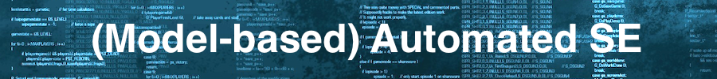

Goto: [Home](README.md) | [Syllabus](syllabus.md) | [Python101](python101.pdf)

sadas
=====

<table>
<tr><td ><b>Admin</b>
</td><td><b>Lectures</b>
</td><td><b>Homework</b>
</td><td><b>Review</b>
</td> </tr>
<tr><td  align=center>
</td><td align=center>
</td><td align=center>
</td><td align=center>
</td> </tr>
<tr><td valign=top>
<ul>
<li>[Syllabus](syllabus.md)</lu1>
<li><a href="Repos">Sample code</a></lu1>
</ul>
</td><td valign=top>
9. [pso](pso.md) 
8. [DiffEvol](de.md) 
7. [nsgaii](nsgaii.md) 
6.  [Ga](ga.md) 
5.  [SKPY](sk.md) 
4.  [A12PY](a12.md)  
3a. <a href="https://github.com/timm/sbse14/wiki/python101py">Python101</a> 
3. <a href="sapy">Coding</a> 
2. [MaxWalkSat](mws.md)  
1. [Sa](sa.md)    

0.[History](

</td><td valign=top>
7. [Homework7](hw7.md) 
6. [Homework6](hw6.md) 
5. [Homework5](hw5.md) 
4. [Homework4](hw4.md)  
3. [Homework3](hw3.md)  
2. [HomeWork2](hw2.md)  
1. [HomeWork1](hw1.md)  
0. [HomeWork0](hw0.md)  

[Models](
</td><td valign=top>
4. [Review4](review4.md) 
3. [Review3](review3.md) 
2. [Review2](review2.md) 
1. [Review1](review1.md) 

</td> 
</tr></table>

